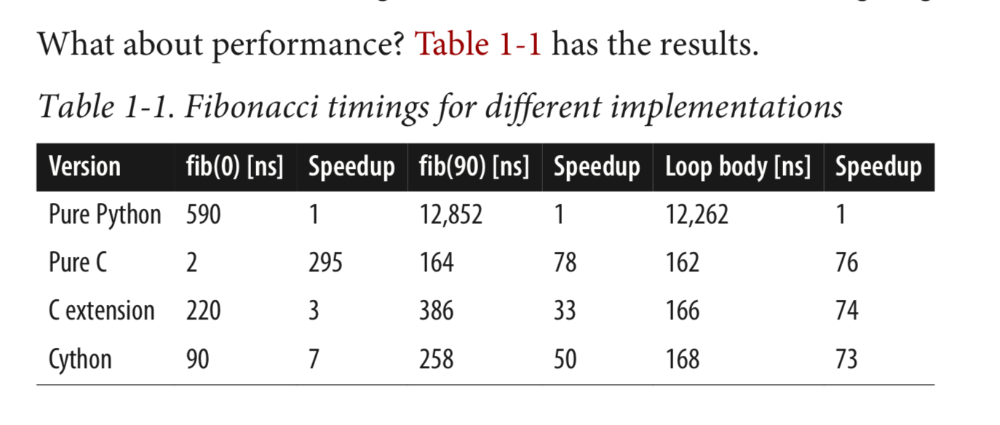
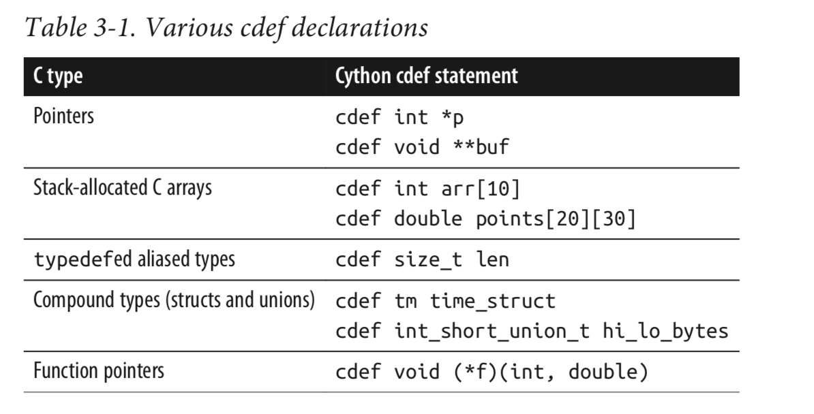
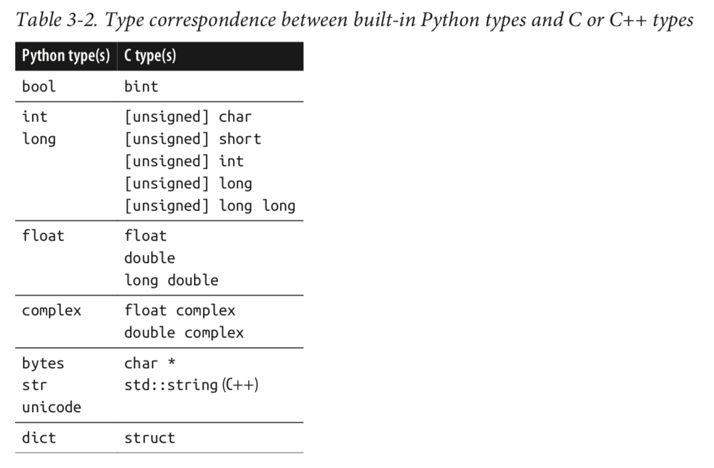
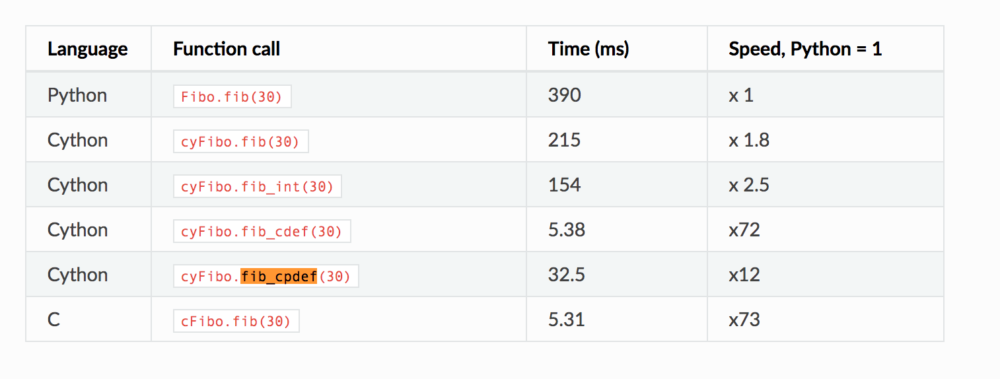
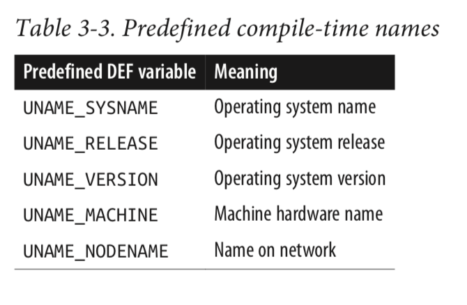

# High-Performance-Python
+ Explore different ways to extend python with high performance tools to enhance performance of the system.

    + CPU :
    The main properties of interest in a computing unit are the number of operations it can do in one cycle
    and the number of cycles it can do in one second. The first value is measured by its instructions per cycle (IPC),
    while the latter value is measured by its clock speed. These two measures are always competing with each other when new computing units are being made.
    For example, the Intel Core series has a very high IPC but a lower clock speed, while the Pentium 4 chip has the reverse.
    GPUs, on the other hand, have a very high IPC and clock speed, but they suffer from other problems like the slow communications that we discuss
    in “Communications Layers”.

    In general, computing units have advanced quite slowly over the past decade (see Figure 1-1). Clock speeds and IPC have both been
    stagnant because of the physical limitations of making transistors smaller and smaller. As a result, chip manufacturers have been
    relying on other methods to gain more speed, including simultaneous multithreading (where multiple threads can run at once), more
    clever out-of-order execution, and multicore architectures.

    + Multithreading :
    Hyperthreading presents a virtual second CPU to the host operating system (OS), and clever hardware logic tries to interleave two threads of
    instructions into the execution units on a single CPU. When successful, gains of up to 30% over a single thread can be achieved. Typically,
    this works well when the units of work across both threads use different types of execution units—for example, one performs floating-point
    operations and the other performs integer operations.

    + Python Problem with Multicore programming :
    Furthermore, a major hurdle with utilizing multiple cores in Python is Python’s use of a global interpreter lock (GIL). The GIL makes sure that a
    Python process can run only one instruction at a time, regardless of the number of cores it is currently using. This means that even though some
    Python code has access to multiple cores at a time, only one core is running a Python instruction at any given time. Using the previous example of
    a survey, this would mean that even if we had 100 question askers, only one person could ask a question and listen to a response at a time. This
    effectively removes any sort of benefit from having multiple question askers! While this may seem like quite a hurdle, especially if the current
    trend in computing is to have multiple computing units rather than having faster ones, this problem can be avoided by using other standard library
    tools, like multiprocessing, technologies like numpy or numexpr, Cython, or distributed models of computing.

    Memory Units
    For example, most memory units perform much better when they read one large chunk of data as opposed to many small chunks (this is referred to as
    sequential read versus random data). If the data in these memory units is thought of as pages in a large book, this means that most memory units have
    better read/write speeds when going through the book page by page rather than constantly flipping from one random page to another. While this fact
    is generally true across all memory units, the amount that this affects each type is drastically different.

    Here is a short description of the various memory units that are commonly found inside a standard workstation, in order of read/write speeds:2

    Spinning hard drive
    Long-term storage that persists even when the computer is shut down. Generally has slow read/write speeds because the disk must be physically spun and moved.
    Degraded performance with random access patterns but very large capacity (10 terabyte range).

    Solid-state hard drive
    Similar to a spinning hard drive, with faster read/write speeds but smaller capacity (1 terabyte range).

    RAM
    Used to store application code and data (such as any variables being used). Has fast read/write characteristics and performs well with random access patterns,
    but is generally limited in capacity (64 gigabyte range).

    L1/L2 cache
    Extremely fast read/write speeds. Data going to the CPU must go through here. Very small capacity (megabytes range).

    ++ Many modes of communication exist, but all are variants on a thing called a bus :
    The frontside bus, for example, is the connection between the RAM and the L1/L2 cache. It moves data that is ready to be transformed by the processor into the
    staging ground to get ready for calculation, and it moves finished calculations out. There are other buses, too, such as the external bus that acts as the main
    route from hardware devices (such as hard drives and networking cards) to the CPU and system memory. This external bus is generally slower than the frontside bus.

    Network Communication :
    In addition to the communication blocks within the computer, the network can be thought of as yet another communication block. This block, though, is much more
    pliable than the ones discussed previously; a network device can be connected to a memory device, such as a network attached storage (NAS) device or another computing
    block, as in a computing node in a cluster. However, network communications are generally much slower than the other types of communications mentioned previously.
    While the frontside bus can transfer dozens of gigabits per second, the network is limited to the order of several dozen megabits.

    IDEALIZED COMPUTING
    When the code starts, we have the value of number stored in RAM. To calculate sqrt_number, we need to send the value of number
    to the CPU. Ideally, we could send the value once; it would get stored inside the CPU’s L1/L2 cache, and the CPU would do the calculations and then send the values
    back to RAM to get stored.
    This scenario is ideal because we have minimized the number of reads of the value of number from RAM, instead opting for reads from the

    $ python -m cProfile -o fib.prof fib.py
    $ pip3 install snakeviz --user

    $ snakeviz fib.profile

### + Cython - Extending python with C/C++

    Cython is two closely related things:
    • Cython is a programming language that blends Python with the static type system of C and C++.
    • cython is a compiler that translates Cython source code into efficient C or C++ source code. This source can then be compiled into a Python extension module or a
      standalone executable.

    +  Cython’s beauty is this: it combines Python’s expressiveness and dy‐ namism with C’s bare-metal performance while still feeling like Python.

    Comparing Python, C, and Cython
    Consider a simple Python function fib that computes the nth Fibonacci number:1

    As mentioned previously, Cython understands Python code, so our unmodified Python fib function is also valid Cython code. To convert the dynamically typed Python version
    to the statically typed Cython version, we use the cdef Cython statement to declare the statically typed C variables i, a, and b. Even for readers who haven’t seen Cython
    code before, it should be straightforward to understand what is going on.

    check the implementations in ./benchmarks

    Pure Python
    The first row (after the header) measures the performance of the pure-Python ver‐ sion of fib, and as expected, it has the poorest performance by a significant
    margin in all categories. In particular, the call overhead for fib(0) is over half a microsec‐ ond on this system. Each loop iteration in fib(90) requires nearly
    150 nanosec‐ onds; Python leaves much room for improvement.

    Pure C
    The second row measures the performance of the pure-C version of fib. In this version there is no interaction with the Python runtime, so there is minimal call
    overhead; this also means it cannot be used from Python. This version provides a bound for the best performance we can reasonably expect from a simple serial fib
    function. The fib(0) value indicates that C function call overhead is minimal (2 nanoseconds) when compared to Python, and the fib(90) runtime (164 nanosec‐ onds)
    is nearly 80 times faster than Python’s on this particular system.

    Hand-written C extension
    The third row measures a hand-written C extension module for Python 2. This extension module requires several dozen lines of C code, most of it boilerplate that calls
    the Python/C API. When calling from Python, the extension module must convert Python objects to C data, compute the Fibonacci number in C, and convert the result back
    to a Python object. Its call overhead (the fib(0) column) is corre‐ spondingly larger than that of the pure-C version, which does not have to convert from and to Python
    objects. Because it is written in C, it is about three times faster than pure Python for fib(0). It also gives a nice factor-of-30 speedup for fib(90).

    Cython
    The last row measures the performance for the Cython version. Like the C exten‐ sion, it is usable from Python, so it must convert Python objects to C data before it can
    compute the Fibonacci number, and then convert the result back to Python. Because of this overhead, it cannot match the pure-C version for fib(0), but, no‐ tably, it has
    about 2.5 times less overhead than the hand-written C extension. Be‐ cause of this reduced call overhead, it is able to provide a speedup of about a factor of 50 over
    pure Python for fib(90).

    So, when properly accounting for Python overhead, we see that Cython achieves C-level performance. Moreover, it does better than the hand-written C extension module on
    the Python-to-C conversions.

    That said, if we determine via profiling that the bottleneck in our program is due to it being I/O or network bound, then we cannot expect Cython to provide a significant improvement
    in performance. It is worth determining the kind of performance bottle‐ neck you have before turning to Cython—it is a powerful tool, but it must be used in the right way.

### + Wrapping C Code with Cython :

    check code in the directory -> ./wrapping-c-code-with-cython

    + code wrap_fib.pyx :
    The cdef extern block may not be immediately transparent, but certain elements are easily identified: we provide the cfib.h header filename in the cdef extern from statement,
    and we declare the cfib function’s signature in the block’s indented body. After the cdef extern block, we define a fib Python wrapper function, which calls cfib and returns its result.

    ++ After compiling the preceding Cython code into an extension module named wrap_fib
    we can use it from Python:
        >>> from wrap_fib import fib
        >>> help(fib)
        Help on built-in function fib in module wrap_fib:
            fib(...)
                Returns the nth Fibonacci number.
        >>> fib(90) 2.880067194370816e+18 >>>

    Cython’s wrap‐ per code is better optimized than a hand-written version of the same.

### + Compiling and Running Cython Code :

    This chapter will cover the various ways to compile Cython code so that it can be run by Python. There are several options:
    • Cython code can be compiled and run interactively from an IPython interpreter.
    • It can be compiled automatically at import time.
    • It can be separately compiled by build tools like Python’s distutils.
    • It can be integrated into standard build systems such as make, CMake, or SCons.

    The Cython Compilation Pipeline
    Because the Cython language is a superset of Python, the Python interpreter cannot import and run it directly. So how do we get
    from Cython source to valid Python? Via the Cython compilation pipeline.

    The pipeline comprises two stages. The first stage is handled by the cython compiler, which transforms Cython source into optimized
    and platform-independent C or C++. The second stage compiles the generated C or C++ source into a shared library with a standard C or C++ compiler.

    The resulting shared library is platform dependent. It is a shared-object file with a .so extension on Linux or Mac OS X, and is a dynamic library with a .pyd
    extension on Windows. The flags passed to the C or C++ compiler ensure this shared library is a full-fledged Python module. We call this compiled module an extension
    module, and it can be imported and used as if it were written in pure Python.

    NB: The cython compiler is a source-to-source compiler, and the gener‐ ated code is highly optimized. It is not uncommon for Cython- generated C code to be faster than
        typical hand-written C. When the author teaches Cython, students often write C equivalents to Cy‐ thon’s code; the Cython version is nearly always faster, and—for
        equivalent algorithms—is never slower. Cython’s generated C code is also highly portable, supporting all common C compilers and many Python versions simultaneously.

    Installing and Testing Our Setup

    - C and C++ compilers :

    Mac OS X
    Install the free OS X developer tools via Xcode; this provides a GCC-like compiler.

    Installing Cython :
    $ pip install cython

    Once we have a C compiler and the cython compiler in place, we are ready to follow along with the distutils and pyximport sections in this chapter.

    The Standard Way: Using distutils with cythonize
    Python’s standard library includes thedistutilspackage for building, packaging, and distributing Python projects. The distutils package has many features; of interest to us
    is its ability to compile C source into an extension module, the second stage in the pipeline. It manages all platform, architecture, and Python-version details for us,
    so we can use one distutils script and run it anywhere to generate our extension module.

    What about the first pipeline stage? That is the job of the cythonize command, which is included with Cython: it takes a Cython source file (and any other necessary options)
    and compiles it to a C or C++ source file, and then distutils takes it from there.

    By using Python’s distutils module combined with Cython’s cythonize command, we have explicit control over the compilation pipeline. This approach requires that we write a
    small Python script and run it explicitly. It is the most common way for Python projects to compile and distribute their Cython code to end users.

    from distutils.core import setup
    from Cython.Build import cythonize

    setup(ext_modules=cythonize('fib.pyx'))

    The core of the script is in the setup(cythonize(...)) nested calls. The cythonize function in its simplest usage converts Cython source to C source code by calling the cython compiler.
    We can pass it a single file, a sequence of files, or a glob pattern that will match Cython files.

    Compiling with distutils on Mac OS X and Linux
    These two function calls succinctly demonstrate the two stages in the pipeline: cythonize calls the cython compiler on the .pyx source file or files, and setup compiles the generated C or C++
    code into a Python extension module.

    It is a simple matter to invoke this setup.py script from the command line:
    $ python setup.py build_ext --inplace

    The build_ext argument is a command instructing distutils to build the Extension object or objects that the cythonize call created. The optional --inplace flag instructs distutils to place
    each extension module next to its respective Cython .pyx source file.

    To get the full list of options that the build_ext subcommand sup‐ ports, we can run:
    $ python setup.py build_ext --help

    $ python setup.py build_ext -i

    ++ after executing this two commands we should see ./build directory and fib.**.so file and a fib.c file transpiled from fib.c.

    Using Our Extension Module
    Whether on Mac OS X, Linux, or Windows, once we have compiled our extension module, we can bring up our Python or IPython interpreter and import the fib module:
        $ ipython --no-banner
        In [1]: import fib
        In [2]: fib?
        In [3]: fib.fib(20)

    Interactive Cython with IPython’s %%cython Magic
    Using distutils to compile Cython code gives us full control over every step of the process. The downside to using distutils is it requires a separate compilation step and
    works only with .pyx source files—no interactive use allowed. This is a definite disad‐ vantage, as one of Python’s strengths is its interactive interpreter, which allows
    us to play around with code and test how something works before committing it to a source file. The IPython project has convenient commands that allow us to interactively
    use Cython from a live IPython session.

    %load_ext Cython
    Now we can use Cython from IPython via the %%cython magic command:
    %%cython
    def fib(int n):
        cdef int i
        cdef double a=0.0, b=1.0
        for i in range(n):
            a, b = a+b, a
        return a

    :exit func with two returns.

    The %%cython magic command allows us to write a block of Cython code directly in the IPython interpreter. After exiting the block with two returns,
    IPython will take the Cython code we defined, paste it into a uniquely named Cython source file, and compile it into an extension module. If compilation
    is successful, IPython will import everything from that module to make the fib function available in the IPython interactive name‐ space. The compilation
    pipeline is still in effect, but it is all done for us automatically.
    We can now call the fib function we just defined:
    In [14]: fib(90)
    Out[14]: 2.880067194370816e+18

    NB: The %%cython magic command recognizes when it has already compiled an identical code block, in which case it bypasses the com‐ pilation step and loads
        the precompiled block directly.

    We can always inspect the generated source file if necessary. It is located in the $IPYTHONDIR/cython directory (~/.ipython/cython on an OS X or *nix system).
    The module names are not easily readable because they are formed from the md5 hash of the Cython source code, but all the contents are there.

    $ cd ~/.ipython/cython

    We can pass optional arguments to the %%cython magic command. The first set of options control the cython compilation stage:

    -n, --name
    Specifies the name of the generated .pyx file

    --cplus
    Instructs cython to generate C++ source

    -a, --annotate
    Instructs cython to output an annotated source file

    -f, --force
    Forces cython to regenerate C or C++ source

    The second set of options allows us to control the second pipeline stage:

    -I, --include
    Adds extra directories to search for file inclusions and cimports

    -c, --compile-args
    Allows inclusion of extra C compiler arguments

    --link-args
    Allows inclusion of extra link arguments

    -L
    Adds extra library search directories

    -l
    dds extra library names to link against

    Compiling On-the-Fly with pyximport
    Because Cython is Python-centric, it is natural to want to work with Cython source files as if they were regular, dynamic,
    importable Python modules. Enter pyximport: it ret‐ rofits the import statement to recognize .pyx extension modules, sends
    them through the compilation pipeline automatically, and then imports the extension module for use by Python.

    check code ./pyximport/use_pyximport.py

    Controlling pyximport and Managing Dependencies
    The pyximport package also handles more complex use cases. For instance, what if a Cython source file depends on other source files,
    such as C or C++ source or header files, or other Cython source files? In this case, pyximport needs to recompile the .pyx file if any
    of its dependencies have been updated, regardless of whether the .pyx file itself has changed. To enable this functionality, we add a
    file with the same base name as the .pyx source file and with a .pyxdeps extension in the same directory as the Cython source file.
    It should contain a listing of files that the .pyx file depends on, one file per line. These files can be in other directories
    relative to the directory of the .pyxdeps file. The entries can also be glob patterns that match multiple files at once. If a
    .pyxdeps file exists, pyximport will read it at import time and compare the modification time of each listed file with the
    modification time of the .pyx file being imported. If any file that matches a pattern in the .pyxdeps file is newer than the
    .pyx file, then pyximport will recompile on import.

    + compiling manaualy :

    $ export CFLAGS=$(python-config --cflags)
    $ export LDFLAGS=$(python-config --ldflags)
    $ cython fib.pyx # --> outputs fib.c
    $ gcc -c fib.c ${CFLAGS} # outputs fib.o
    $ gcc fib.o -o fib.so -shared ${LDFLAGS} # --> outputs fib.so

    Using Cython with Other Build Systems

    + CMAKE :
    # Detects and activates Cython
    include(UseCython)
    # Specifies that Cython source files should generate C++
    set_source_files_properties(
      ${CYTHON_CMAKE_EXAMPLE_SOURCE_DIR}/src/file.pyx
      PROPERTIES CYTHON_IS_CXX TRUE )
    # Adds and compiles Cython source into an extension module
    cython_add_module( modname file.pyx cpp_source.cxx)

    + convert syntax from python2 to python3
    $ 2to3 -x apply irrationals.py

    + generate c file from python file :
    $ cython --embed irrationals.py

    This generates irrationals.c with a main entry point that embeds a Python interpreter.
    We can compile irrationals.c on Mac OS X or Linux using python-config:
    %% compile
    $ gcc $(python-config --cflags) $(python-config --ldflags) ./irrationals.c

    %% run
    $ ./a.out
    e**pi == 23.14
    pi**e == 22.46

### + Cython in Depth :

    - python interpreter vs C compiler :

    There is a way to bridge the divide between the bytecode-executing VM and machine code–executing CPU: the Python interpreter can run
    compiled C code directly and transparently to the end user. The C code must be compiled into a specific kind of dynamic library known
    as an extension module. These modules are full-fledged Python modules, but the code inside of them has been precompiled into machine
    code by a standard C compiler. When running code in an extension module, the Python VM no longer interprets high-level bytecodes, but
    instead runs machine code directly. This removes the interpreter’s performance overhead while any operation inside this extension module is running.

    ++ Cython gives us this speedup for free, and we are glad to take it. But the real performance improvements come from replacing Python’s
    dynamic dispatch with static typing.

    Dynamic Versus Static Typing

    python - dynamic typing
    When running a Python program, the interpreter spends most of its time figuring out what low-level operation to perform, and extracting the data
    to give to this low-level operation. Given Python’s design and flexibility, the Python interpreter always has to determine the low-level operation
    in a completely general way, because a variable can have any type at any time. This is known as dynamic dispatch, and for many reasons,
    fully general dynamic dispatch is slow.

    c - static typing
    The situation for C is very different. Because C is compiled and statically typed, the C compiler can determine at compile time what low-level operations
    to perform and what low-level data to pass as arguments. At runtime, a compiled C program skips nearly all steps that the Python interpreter must perform.
    For something like a + b with a and b both being fundamental numeric types, the compiler generates a handful of machine code instructions to load the data
    into registers, add them, and store the result.

    A compiled C program spends nearly all its time calling fast C functions and performing fundamental operations.
    is it any wonder that a language like C can be hundreds, or even thousands, of times faster than Python for certain operations?

### + cdef declarations :

    Consider the following simple function:
    def automatic_inference():
        i=1
        d=2.0
        c=3+4
        r=i*d+c
        return r

    In this example, Cython types the literals 1 and 3+4j and the variables i, c, and r as general Python objects. Even though these types have obvious
    corresponding C types, Cython conservatively assumes that the integer i may not be representable as a C long, so types it as a Python object with
    Python semantics. Automatic inference is able to infer that the 2.0 literal, and hence the variable d, are C doubles and proceeds ac‐ cordingly.
    To the end user, it is as if d is a regular Python object, but Cython treats it as a C double for performance.

    By means of the infer_types compiler directive, we can give Cython more leeway to infer types in cases that may possibly change semantics—for example,
    when integer addition may result in overflow.
    To enable type inference for a function, we can use the decorator form of infer_types:

    cimport cython

    @cython.infer_types(True)
    def more_inference():
            i=1
            d=2.0
            c=3+4j
            r=i*d+c r
            eturn r

    Because infer_types is enabled for more_inference, the variable i is typed as a C long; d is a double, as before, and both c and r are C-level complex variables
    When enabling infer_types, we are taking responsibility to ensure that integer operations do not overflow and that semantics do not change from the untyped version.
    The infer_types directive can be enabled at function scope or globally, making it easy to test whether it changes the results of the code base, and whether it makes
    a difference in performance.

    + you can enable infer_types in a global level :

    # cython: infer_types=True

    C Pointers in Cython

    cdef int *p_int
    cdef float** pp_float = NULL

    cdef st_t *p_st = make_struct()
    cdef int a_doubled = p_st.a + p_st.a

    Wherever we use the arrow operator in C, we use the dot operator in Cython, and Cython will generate the proper C-level code.

    cdef int a,b,c
    # ...Calculations using a, b, and c...

    tuple_of_ints = (a, b, c)

    This code is trivial, boring even. The point to emphasize here is that a, b, and c are statically typed integers, and Cython allows
    the creation of a dynamically typed Python tuple literal with them.

    This example works because there is an obvious correspondence between C ints and Python ints, so Python can transform things automatically
    for us. This example would not work as is if a, b, and c were, for example, C pointers. In that case we would have to dereference them
    before putting them into the tuple, or use another strategy.

    Table 3-2 gives the full list of correspondences between built-in Python types and C or C++ types.

    The bint type
    The bint Boolean integer type is an int at the C level and is converted to and from a Python bool. It has the standard C interpretation of truthiness:
    zero is False, and non‐ zero is True.

    Integral type conversions and overflow
    In Python 2, a Python int is stored as a C long, and a Python long has unlimited precision. In Python 3, all int objects are unlimited precision.
    When converting integral types from Python to C, Cython generates code that checks for overflow. If the C type cannot represent the Python integer,
    a runtime OverflowError is raised.
    There are related Boolean overflowcheck and overflowcheck.fold compiler direc‐ tives that will catch overflow errors when we are working with C integers.
    If overflowcheck is set to True, Cython will raise an OverflowError for overflowing C integer arithmetic operations. The overflowcheck.fold directive,
    when set, may help remove some overhead when overflowcheck is enabled.

    Following the principle of least astonishment, Cython uses Python semantics by default for division and modulus even when the operands are statically typed C scalars.
    To obtain C semantics, we can use the cdivision compiler directive

     # cython: cdivision=True
    or at the function level with a decorator:
    cimport cython
    @cython.cdivision(True)
    def divides(int a, int b):
        return a/b

    or within a function with a context manager:

    cimport cython
    def remainder(int a, int b):
    with cython.cdivision(True):
        return a%b

    benchmark on the folder of factorial - python interpreter vs cython compiler :

    # near two times cython function faster than python func on 1000000 iterations

    """
    runtime of cython method even if it s wrote with dynamic typing and pure python 1.7897053609999998 sec
    runtime of pure python executed on python interpreter 3.825792878 sec
    runtime of cython with statical typing and pure python 1.4818592860000006 sec
    """

    # we can observe that statically typing variables will enhance performance of our cython func from this 1.7897053609999998 sec to this 1.4818592860000006 sec.

    The py_fact function runs approximately two times faster with Cython for small input values on this system, although the speedup depends on a number of factors.
    The source of the speedup is the removal of interpretation overhead and the reduced function call overhead in Cython.

    When defining any function in Cython, we may mix dynamically typed Python object arguments with statically typed arguments. Cython allows statically typed arguments
    to have default values, and statically typed arguments can be passed positionally or by keyword.

    cdef long c_fact(long n):
    """Computes n!"""
    if n <= 1:
        return 1
    return n * c_fact(n - 1)

    # If we want to use c_fact from Python code outside this extension module, we need a minimal def function that calls c_fact internally:
    def wrap_c_fact(n):
        """Computes n!"""
        return c_fact(n)

### - a little benchmark of cdef, cpdef, c and python :

    - list casting in cython :
        def safe_cast_to_list(a):
        cdef list cast_list = <list?>a
        print type(a)
        print type(cast_list)
        cast_list.append(1)

    struct, unions and enums
    the equivalent Cython declarations are:
    cdef struct mycpx:
        float real
        float imag
    cdef union uu:
        int a
        short b, c

    To declare a variable with the struct type, simply use cdef, and use the struct type as
    you would any other type:
    cdef mycpx zz

    We can initialize a struct in three ways:
    • We can use struct literals:
    cdef mycpx a = mycpx(3.1415, -1.0)
    cdef mycpx b = mycpx(real=2.718, imag=1.618034)

    The struct fields can be assigned by name individually:
    cdef mycpx zz
    zz.real = 3.1415
    zz.imag = -1.0

    Lastly, structs can be assigned from a Python dictionary:
    cdef mycpx zz = {'real': 3.1415, 'imag': -1.0}

    - nested cython struct :

    cdef struct _inner:
        int inner_a

    cdef struct nested:
        int outer_a
        _inner inner

    We can initialize a nested struct on a field-by-field basis or by assigning to a nested dictionary
    that matches the structure of nested:

    cdef nested n = {'outer_a': 1, 'inner': {'inner_a': 2}}

    To define an enum, we can define the members on separate lines, or on one line separated
    with commas:
    cdef enum PRIMARIES:
        RED=1
        YELLOW = 3
        BLUE=5

    cdef enum SECONDARIES:
        ORANGE, GREEN, PURPLE

    - Cython for Loops and while Loops :

    Consider the common Python for loop over a range:
    n=100
    # ...
    for i in range(n):
    # ...

    If the index variable i and range argument n are dynamically typed, Cython may not be able to generate a fast C for loop.
    We can easily fix that by typing i and n:

    cdef unsigned int i, n = 100

    for i in range(n):
    # ...

    Cython is often able to infer types and generate fast loops automatically, but not always. The following guidelines will help
    Cython generate efficient loops.

    Performance-wise, the Cython code with the extra typing information is consistently
    two to three times faster than the untyped equivalent.

    The Cython Preprocessor
    Cython has a DEF keyword that creates a macro, which is a compile-time symbolic con‐ stant akin to #define C preprocessor symbolic macros. These can be useful for giving meaningful names to magic numbers, allowing them to be updated and changed in a single location. They are textually substituted with their value at compile time.

    + For example:

        DEF E = 2.718281828459045
        DEF PI = 3.141592653589793

    def feynmans_jewel():
        """Returns e**(i*pi) + 1. Should be ~0.0"""
        returnE**(1*PI)+1.0

    Taking an example from Cython’s documentation, say we want to branch based on the OS we are on:
    IF UNAME_SYSNAME == "Windows":
    # ...Windows-specific code...
    ELIF UNAME_SYSNAME == "Darwin": # ...Mac-specific code...
    ELIF UNAME_SYSNAME == "Linux": # ...Linux-specific code...
    ELSE:
    # ...other OS...

    Bridging the Python 2 and Python 3 Divide
    As we learned in Chapter 2, cython generates a C source file that is compiled into an extension module with a
    specific version of Python. Conveniently, we can write our Cython .pyx file using either Python 2 or Python 3 syntax.
    The generated C source file is compatible with either Python 2 or Python 3. This means any Cython code can be compiled for either Python 2 or Python 3 runtimes.

    - compiling a cython file `einstein.pyx` with python 3:

    import sys
    print("If facts don't fit the theory, change the facts.", file=sys.stderr)

    it will not compile assuming Python 2 syntax. So, we must pass in the -3 flag to set Python 3 syntax:

    $ cython -3 einstein.pyx

    - If the Pareto principle is to be believed, then roughly 80 percent of the runtime in a library is due to just 20 percent of the code. For a Python project
    to see major perfor‐ mance improvements, it need only convert a small fraction of its code base from Python to Cython.
